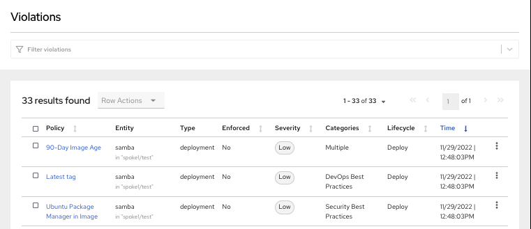
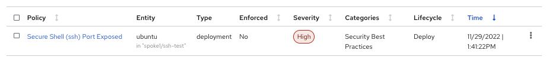
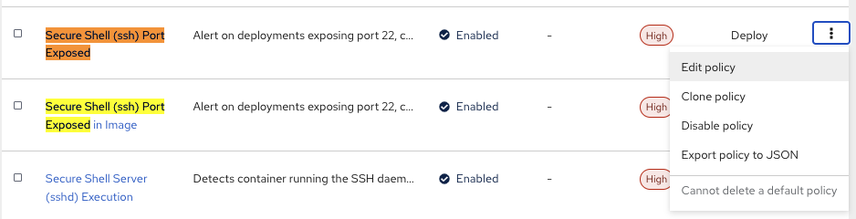
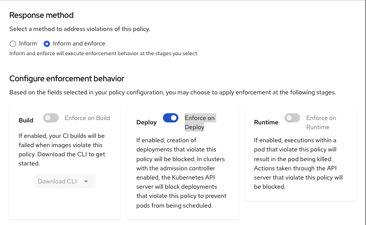

Start the management of Spoke1

```
export CLUSTER_NAME=spoke1
```

Login to the Spoke1 cluster

```
oc login --token=superSecur3T0ken --server=http://${CLUSTER_NAME}:8001
```

Create a new project:

```
kubectl create namespace test
```
Start some applications with critical vulnerabilities:

```
kubectl run shell --labels=app=shellshock,team=test-team \
  --image=vulnerables/cve-2014-6271 -n test
```

```
kubectl run samba --labels=app=rce \
  --image=vulnerables/cve-2017-7494 -n test
```

Navigate to the RHACS portal to view the violations.



Next, create a Pod/Application that enables ssh

Create the namespace
```
kubectl create namespace ssh-test
```

Enable the service
```
kubectl -n ssh-test create -f - << EOF
apiVersion: v1
kind: Service
metadata:
  name: ubuntu-lb
  labels:
    app: ubuntu
spec:
  ports:
    - port: 22
  selector:
    app: ubuntu
  type: LoadBalancer
EOF
```

Create the Deployment on the ssh-test namespace
```
kubectl -n ssh-test create -f - << EOF
apiVersion: apps/v1
kind: Deployment
metadata:
  name: ubuntu
  labels:
    app: ubuntu
spec:
  selector:
    matchLabels:
      app: ubuntu
  template:
    metadata:
      labels:
        app: ubuntu
    spec:
      containers:
      - name: ubuntu
        image: ubuntu:18.04
        ports:
        - containerPort: 22
        command:
          - "sleep"
          - "604800"
EOF
```

Check the Pods are running in the corrrect namespace

```
kubectl get pods -n ssh-test
```

Now Review the Violations Tab again on the RHACS console

Search for "Secure Shell (ssh) Port Exposed"



Next, set the policy to enforce.

Go to "Platform Configuration" in the Menu, then select "Policy management"

Now search for "Secure Shell (ssh) Port Exposed"

Select the first one and click on "Edit policy"



Then choose No.2 "Policy behavior" on the left

Looks for "Response method" and change this to "Inform and enforce" and enable "Enforce on Deploy" option



Now click on the "Next" 3 times and then "Save" this policy

Next, deploy the same Pod/Application in a new namespace in the "Work" Shell

Create the namespace
```
kubectl create namespace ssh-test-enforce
```

Enable the service
```
kubectl -n ssh-test-enforce create -f - << EOF
apiVersion: v1
kind: Service
metadata:
  name: ubuntu-lb
  labels:
    app: ubuntu
spec:
  ports:
    - port: 22
  selector:
    app: ubuntu
  type: LoadBalancer
EOF
```

Create the Deployment on the ssh-test-enforce namespace
```
kubectl -n ssh-test-enforce create -f - << EOF
apiVersion: apps/v1
kind: Deployment
metadata:
  name: ubuntu
  labels:
    app: ubuntu
spec:
  selector:
    matchLabels:
      app: ubuntu
  template:
    metadata:
      labels:
        app: ubuntu
    spec:
      containers:
      - name: ubuntu
        image: ubuntu:18.04
        ports:
        - containerPort: 22
        command:
          - "sleep"
          - "604800"
EOF
```

```
kubectl get pods -n ssh-test-enforce
```

You will now notice no pods are running. Let's check the event logs

```
kubectl get events -n ssh-test-enforce | grep -i Stackrox
```

You should now see a similar message about RHACS enforcing this policy and preventing the Pod/Application from running

```
10s          Warning   StackRox enforcement   deployment/ubuntu             Deployment violated StackRox policy "Secure Shell (ssh) Port Exposed" and was scaled down
```

Completed, move onto the next assignment.
